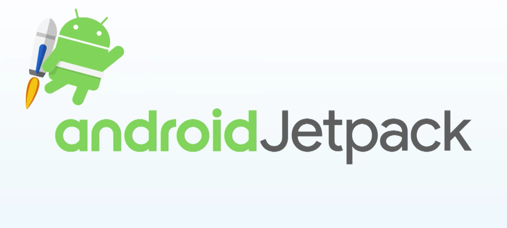
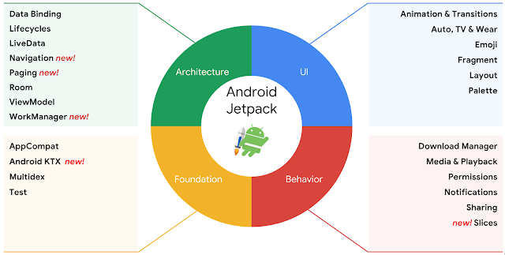
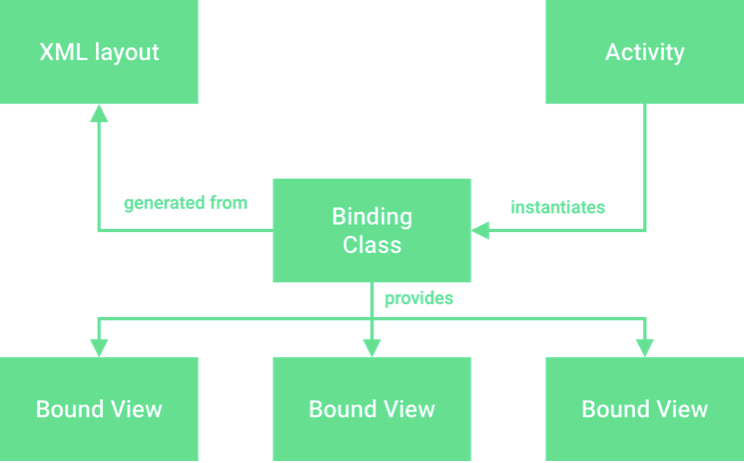
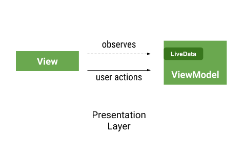
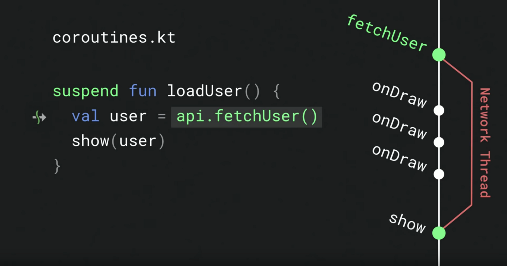
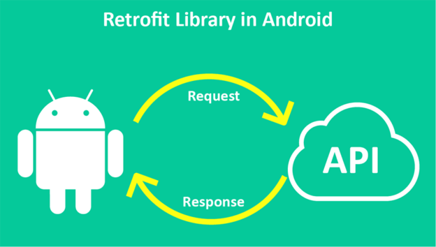
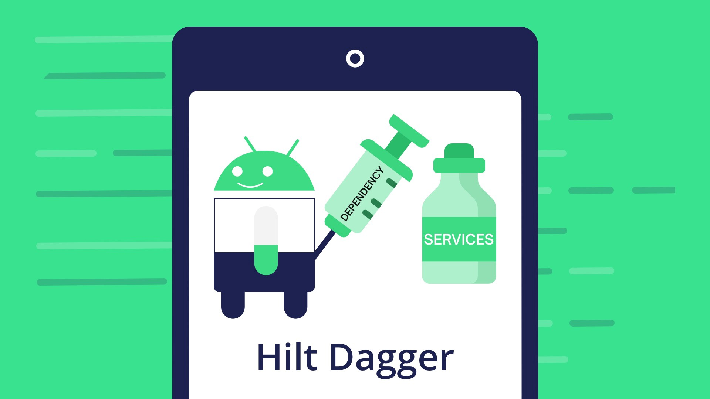

# Kotlin Jetpack Android

Ejemplo de implementar poco a poco Jetpack Android en Kotlin

- [Kotlin Jetpack Android](#kotlin-jetpack-android)
  - [Acerca de](#acerca-de)
  - [Android Jetpack](#android-jetpack)
  - [View Binding](#view-binding)
  - [View Model](#view-model)
  - [Live Data](#live-data)
  - [Coroutines](#coroutines)
  - [Retrofit 2](#retrofit-2)
  - [Room](#room)
  - [Hilt](#hilt)
  - [Flows](#flows)
  - [Autor](#autor)
    - [Contacto](#contacto)
  - [Licencia](#licencia)
      - [Agradecimientos](#agradecimientos)

## Acerca de

El siguiente proyecto tiene como objetivo acercar cómo implementar Jetpack Android en Kotlin.

El proyecto consiste en la colección de películas con almacenamiento, favoritos, consultas a api rest e inyección de
dependencias.

## Android Jetpack

Jetpack es un conjunto de bibliotecas que ayuda a los desarrolladores a seguir las prácticas recomendadas, reducir el
código estándar y escribir código que funcione de manera coherente en los dispositivos y las versiones de Android para
que puedan enfocarse en el código que les interesa.

A lo largo de este proyecto se ha usado distintos elementos de Jetpack siguiendo la siguiente arquitectura:

Más información en:

- https://developer.android.com/jetpack
- https://developer.android.com/topic/libraries/architecture?hl=es-419

## View Binding

La vinculación de vista es una función que te permite escribir más fácilmente código que interactúa con las vistas. Una
vez que la vinculación de vista está habilitada en un módulo, genera una clase de vinculación para cada archivo de
diseño XML presente en ese módulo. Una instancia de una clase de vinculación contiene referencias directas a todas las
vistas que tienen un ID en el diseño correspondiente. En la mayoría de los casos, la vinculación de vistas reemplaza
a ***findViewById***.

La vinculación de vistas tiene ventajas importantes frente al uso de findViewById:

- Seguridad nula: Debido a que la vinculación de vista crea referencias directas a las vistas, no hay riesgo de una
  excepción de puntero nulo debido a un ID de vista no válido. Además, cuando una vista solo está presente en algunas
  configuraciones de un diseño, el campo que contiene su referencia en la clase de vinculación se marca con @Nullable.
- Seguridad de tipos: Los campos de cada clase de vinculación tienen tipos que coinciden con las vistas a las que hacen
  referencia en el archivo XML. Esto significa que no hay riesgo de una excepción de transmisión de clase.
  Estas diferencias significan que las incompatibilidades entre tu diseño y tu código harán que falle la compilación
  durante el momento de compilación en lugar de hacerlo en el tiempo de ejecución.

- Más información: https://developer.android.com/topic/libraries/view-binding

## View Model

ViewModel nos permite almacenar y administrar datos relacionados con la IU de manera optimizada para los ciclos de vida
y con ello realizar una vinculación entre los datos y su representación en la interfaz y con ellos implementar el patrón
MVVM. Es responsable de preparar y manejar estados para la UI. Tiene una relación directa con la vista para
mostrar los datos. Mediante el uso de ViewModel seremos capaces de desacoplar la lógica de presentación de los
componentes de UI.

La vista espera un estado de UI proporcionado por ViewModel y, a su vez, ViewModel podrá actualizar dicho estado de UI
si se producen eventos desde la vista. En resumen, la vista podrá recibir actualizaciones del estado de UI desde el
ViewModel.

- Más información: https://developer.android.com/topic/libraries/architecture/viewmodel?hl=es-419

## Live Data

LiveData es una clase de contenedor de datos observable. LiveData está optimizado para ciclos de vida, lo que significa
que respeta el ciclo de vida de otros componentes de las apps, como actividades, fragmentos o servicios.

Permite que otros componentes se suscriban a él con el fin de ser notificados si se produce algún cambio. Contiene un
estado y su principal responsabilidad es avisar a sus
suscriptores cuando dicho estado cambie.

Fragments y Activities pueden suscribirse a un componente LiveData para ser notificados siempre que se produzca una
actualización. Si se produce un evento y los datos relacionados con el componente LiveData cambian, los Fragments y
Activities suscritos a él serán
notificados al mismo tiempo. LiveData está pendiente del ciclo de vida de Activities y Fragments. Si estos van a un
estado onDestroy el componente LiveData cierra y destruye la conexión con ellos automáticamente.

De esta manera combinando LiveData con ViewModel, podremos observar los datos de la vista y el ViewModel en tiempo real
y aplicar patrones reactivos.

- Más información: https://developer.android.com/topic/libraries/architecture/livedata?hl=es-419

## Coroutines

Coroutines es una biblioteca de Kotlin que permite la ejecución de código asíncrono en una manera más eficiente. En
Android, las corrutinas ayudan a administrar tareas de larga duración que, de lo contrario, podrían bloquear el
subproceso principal (o hilo principal) y hacer que tu app dejará de responder. Los componentes optimizados para ciclos
de vida proporcionan compatibilidad de primer nivel con las corrutinas para alcances lógicos de tu app, junto con una
capa de interoperabilidad con LiveData Nos ofrecen:

- Ligereza: Puedes ejecutar muchas corrutinas en un solo subproceso debido a la compatibilidad con la suspensión, que no
  bloquea el subproceso en el que se ejecuta la corrutina. La suspensión ahorra más memoria que el bloqueo y admite
  muchas operaciones simultáneas.
- Menos fugas de memoria: Usa la simultaneidad estructurada para ejecutar operaciones dentro de un alcance.
- Compatibilidad con cancelación incorporada: Se propaga automáticamente la cancelación a través de la jerarquía de
  corrutinas en ejecución.
- Integración con Jetpack: Muchas bibliotecas de Jetpack incluyen extensiones que proporcionan compatibilidad total con
  corrutinas. Además, algunas bibliotecas proporcionan su propio alcance de corrutina, que puedes usar para la
  simultaneidad estructurada.

Un de los aspectos importantes de las corrutinas son las funciones de suspensión y la concurrencia estructurada. Nos
ofrecen:

- Pueden detener la ejecución de la coroutine en cualquier punto y devolver el
  resultado al hilo original.
- Pueden ejecutarse en el hilo principal o en un hilo diferente.
- Solo pueden ejecutarse dentro de una coroutine o dentro de otra función de
  suspensión evitando fugas de la coroutine.

- Más información: https://developer.android.com/kotlin/coroutines?hl=es-419
- Un proyecto de corrutinas: https://github.com/joseluisgs/kotlint-init-coroutines

## Retrofit 2
Librería desarrollada por la empresa Square y recomendada por
Google en su arquitectura Android. Se encarga de facilitar la integración de una aplicación con un
API REST.

Retrofit 2 soporta los tipos de operaciones REST: GET, POST, PUT, PATCH y DELETE. Ya sea peticiones con Query, Body, Headers, Multipart, etc. Además, descarga datos en formato XML o JSON desde el API y los parsea en una data class (Kotlin) o POJO (Java) definida
previamente.

Además se se integra perfectamente con Coroutines.

- Más información: https://square.github.io/retrofit/
- Un proyecto con Retrofit: https://github.com/joseluisgs/Kotlin-REST-Retrofit

## Room
Room es una librería desarrollada por Android (Google) que simplifica el manejo de datos en bases de datos SQLite. Room es el ORM (Object Relational Mapping) de Android propuesto por Google en la suite de librerías de Jetpack.

La biblioteca de persistencias Room brinda una capa de abstracción para SQLite que permite acceder a la base de datos sin problemas y, al mismo tiempo, aprovechar toda la tecnología de SQLite. En particular, Room brinda los siguientes beneficios:
- Verificación del tiempo de compilación de las consultas en SQL
- Anotaciones de conveniencia que minimizan el código estándar repetitivo y propenso a errores
- Rutas de migración de bases de datos optimizadas

Estos son los tres componentes principales de Room:
- La clase de la base de datos que contiene la base de datos y sirve como punto de acceso principal para la conexión subyacente a los datos persistentes de la app y nos proporcionas DAOs.
- Las entidades de datos que representan tablas de la base de datos de tu app.
- Objetos de acceso a datos (DAOs) que proporcionan métodos que tu app puede usar para consultar, actualizar, insertar y borrar datos en la base de datos.

Más información: https://developer.android.com/training/data-storage/room?hl=es-419

## Hilt
Hilt es una librería de inyección de dependencias desarrollada y recomendada por Google. Hilt está construido a partir de Dagger y ahora forma parte del framework de Android.

Implementar la inyección de dependencias (DI), es una de las prácticas recomendadas no solo por Google si no en cualquier desarrollo de software. Te proporciona las siguientes ventajas:
- Principio de Responsabilidad Única (SRP - SOLID)
- Reutilización de código
- Facilidad de refactorización
- Facilidad de prueba

Para ello las dependencias no deben crearse dentro de nuestro módulo. Porque:
- Desde fuera no veremos con qué módulos se interactúa.
- En los tests no podemos probar nuestro módulo de forma aislada, ejecutamos lógica del módulo del que se depende.

¿Quién provee las dependencias?
- Todos los módulos exponen ahora sus dependencias por constructor.
- Crear una clase que se encargue de proveer instancias de todas las dependencias es un trabajo enorme.
- Los inyectores de dependencias se encargan de ello.
- Existen muchos inyectores de dependencias: Hilt, Koin, Dagger...

Más información:
- Hilt: https://developer.android.com/training/dependency-injection/hilt-android?hl=es-419
- DI Android con Hilt: https://devexperto.com/dagger-hilt/
- Un proyecto para entender DI: https://github.com/joseluisgs/Kotlin-DI-Ejemplos

## Flows
Un flujo es conceptualmente una transmisión de datos que se puede computar de forma asíncrona. En una estructura de flujo de datos “en frío”, los elementos son producidos y emitidos bajo demanda. Ésto quiere decir que los elementos se empiezan a producir y emitir hasta que el consumidor lo requiera y actúan de manera asíncrona. 

En Android, un repositorio es, generalmente, un productor de datos de IU que tiene la interfaz de usuario (IU) como consumidor que, en última instancia, muestra los datos. 

El flujo está integrado en varias bibliotecas de Jetpack y es popular entre las bibliotecas de terceros de Android. El flujo es una gran opción para las actualizaciones de datos en tiempo real y los flujos de datos infinitos.

Puedes usar Flow with Room (flujo con Room) para recibir notificaciones sobre los cambios en una base de datos. Cuando uses objetos de acceso a datos (DAO), muestra un tipo Flow para obtener actualizaciones en tiempo real.

Más información: 
- Flow: https://developer.android.com/kotlin/flow
- Un proyecto con Flow: https://github.com/joseluisgs/kotlint-init-coroutines#flujos

## Autor

Codificado con :sparkling_heart: por [José Luis González Sánchez](https://twitter.com/joseluisgonsan)

### Contacto

  Cualquier cosa que necesites házmelo saber por si puedo ayudarte 💬.

     &nbsp;&nbsp;
     &nbsp;&nbsp;
      &nbsp;&nbsp;
    

## Licencia

Este proyecto está licenciado bajo licencia **MIT**, si desea saber más, visite el fichero [LICENSE](./LICENSE) para su
uso docente y educativo.

#### Agradecimientos

Proyecto basado en el curso de Openwebinars: Curso de Android Jetpack Architecture